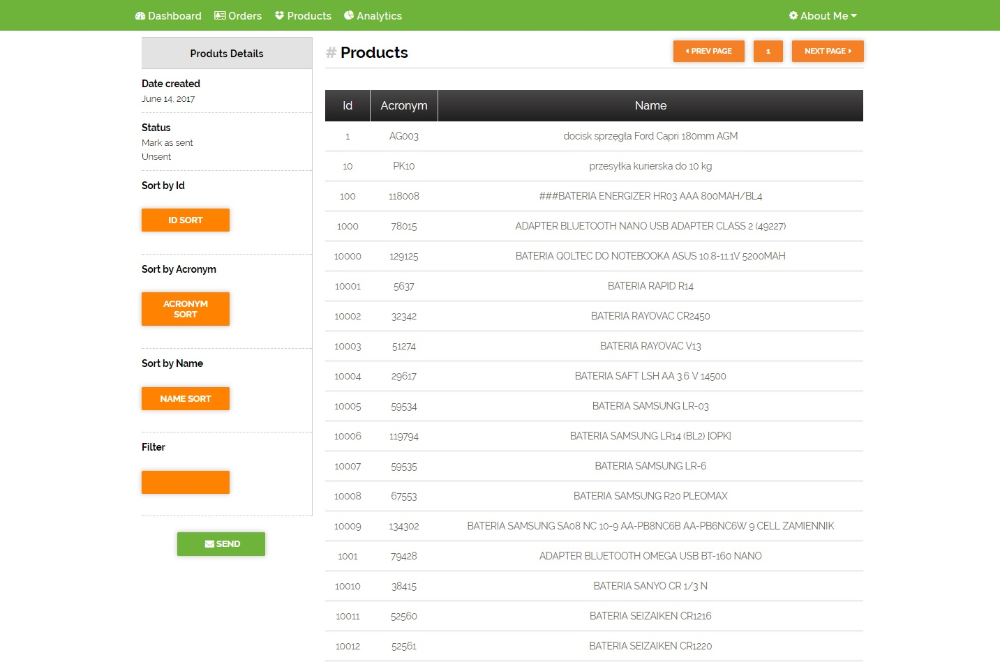

# AJAX-sort-Website

A simple website that allows you to sort the table downloaded by AJAX. Options: go to next page, pagination, data filter. Downloading data works only locally, to see exactly how the page works, please clone the repository to your computer.

## Used technologies: 

* HTML
* CSS 
* SASS
* RWD 
* JQuery 

## Demo:

https://mateuszbieniek92.github.io/AJAX-sort-Website/

## Demo image:

